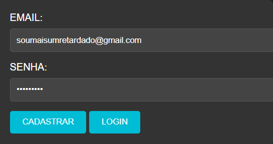

# LOGIN COM NODEJS E SQL SERVER
👨‍🏫FORMULARIO DE CADASTRO E LOGIN EM HTML, CSS, JS (NODEJS) E SQL SERVER.

 <br> 

## DESCRIÇÃO:
Este aplicativo é um sistema de login e cadastro desenvolvido em Node.js utilizando o framework Express.js para criar o servidor web e o banco de dados SQL SERVER para armazenar informações dos usuários.

## FUNCIONALIDADES:
- Quando um usuário acessa o aplicativo através do navegador, ele é apresentado com um formulário HTML contendo campos para e-mail, senha e botões para login e cadastro.
- Quando o usuário preenche o formulário e envia, os dados são enviados para o servidor Node.js.
- No servidor, os dados são processados e verificados:
  - Se o usuário optar por se cadastrar, suas informações são inseridas no banco de dados.
  - Se o usuário optar por fazer login, suas informações são comparadas com as informações armazenadas no banco de dados. Se forem válidas, o login é bem-sucedido; caso contrário, uma mensagem de erro é retornada.
- O servidor responde ao navegador com uma mensagem de sucesso ou erro, que é exibida ao usuário.

## EXECUTANDO O PROJETO:
1. **Configuração do Banco de Dados:**
   - Antes de executar o site, é necessário importar o arquivo `DATABASE.sql`. 

2. **Configuração do JS:**
   - Abra o arquivo `./CODIGO/CODIGO.js` e ajuste as configurações do seu banco de dados nos parâmetros de `sequelize`:

     ```javascript
      // Configurações de conexão com o SQL Server para autenticação integrada do Windows
      const config = {
      user: '', // Deixe vazio para autenticação do Windows
      password: '', // Deixe vazio para autenticação do Windows
      server: 'localhost', // Nome do servidor SQL Server
      database: 'registro',
      options: {
         trustedConnection: true, // Usar autenticação integrada do Windows
         encrypt: false, // Defina como true se usar conexões criptografadas
      }
      };
     ```

3. **Instalando as Depêndencias:**
   - Para instalar as dependências listadas no arquivo "package.json", você pode usar o comando `npm install` ou simplesmente `npm i` no terminal. Certifique-se de estar no diretório do seu projeto onde o arquivo "package.json" está localizado. O npm irá ler o arquivo "package.json" e instalar todas as dependências listadas nele. 

   - Aqui está o comando:

   ```bash
   npm install
   ```

4. **Executando o Aplicativo:**
   - Para subir o servidor, no diretório do seu [projeto](./CODIGO/CODIGO.js), digite o seguinte comando no Terminal/CMD:

   - Para usar o `NODE`, inicie com o seguinte comando:
    ```bash
    npm start
    ```

    - Para usar o `NODEMON`, inicie com o seguinte comando:
    ```bash
    npm test
    ```

   - Acesse o APP no navegador visitando [http://localhost:3000](http://localhost:3000). Se cadastre e faça o login.

## NÃO SABE?
- Entendemos que para manipular arquivos em `HTML`, `CSS` e outras linguagens relacionadas, é necessário possuir conhecimento nessas áreas. Para auxiliar nesse aprendizado, oferecemos cursos gratuitos disponíveis:
* [CURSO DE HTML E CSS](https://github.com/VILHALVA/CURSO-DE-HTML-E-CSS)
* [CURSO DE NODEJS](https://github.com/VILHALVA/CURSO-DE-NODEJS)
* [CURSO DE SQL SERVER](https://github.com/VILHALVA/CURSO-DE-SQL-SERVER)
* [CURSO DE EXPRESSJS](https://github.com/VILHALVA/CURSO-DE-EXPRESSJS)
* [CONFIRA MAIS CURSOS](https://github.com/VILHALVA?tab=repositories&q=+topic:CURSO)

## CREDITOS:
- [PROJETO BASEADO NO "CADASTRO E LOGIN COM NODEJS"](https://github.com/VILHALVA/CADASTRO-E-LOGIN-COM-NODEJS)
- [PROJETO FEITO PELO VILHALVA](https://github.com/VILHALVA)


